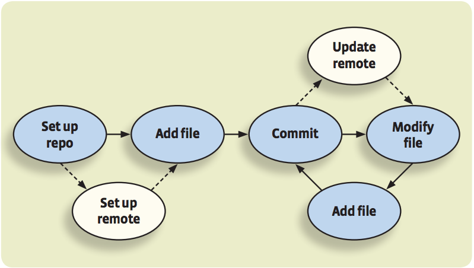
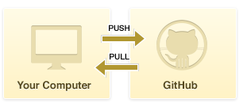
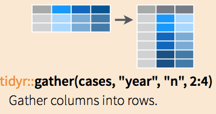
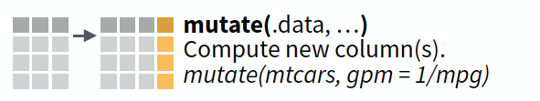
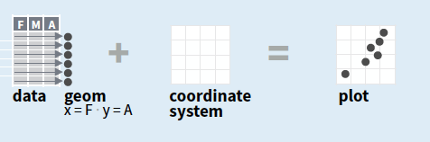
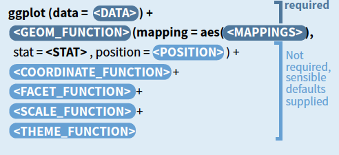
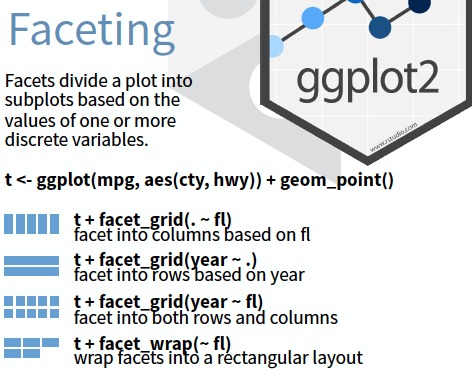
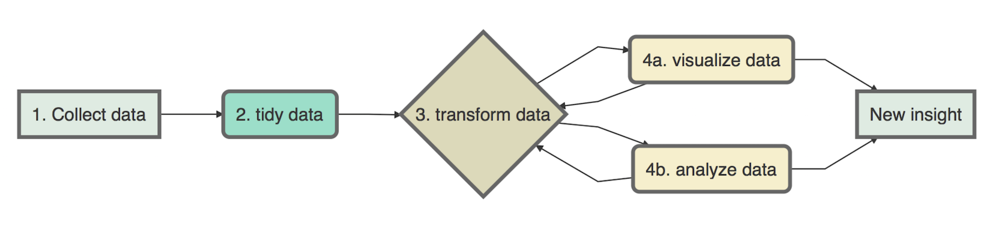
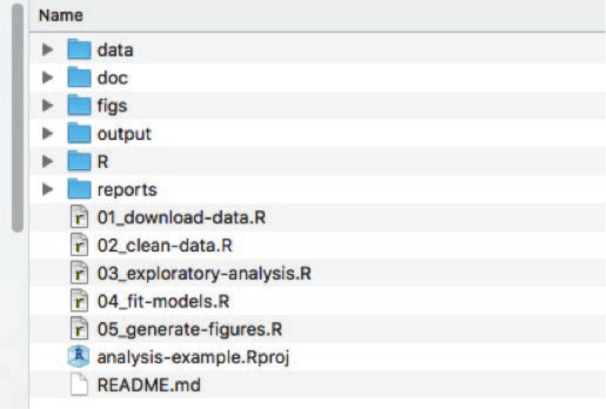

```{r setup, include=FALSE}
options(htmltools.dir.version = FALSE)
```

class: inverse, center, middle

# Get started with version control


---
class: center, middle
# Let's recap

---
class: center
# Version control


---

class: center
# Version control


---

# Workflow



---
# Set up repository

1. Go to your [Gihub](https://github.com/) account
2. Go to the repositories tab and press New
3. Name your new repository
4. Copy the web url https://github.com/username/repository.git


---

# Workflow


---
# Set up remote


---

# Set up remote


---
class: center, middle
# Create files or add files

---
class: center
# First commit


---
class: center
# First commit


---
class: center
# Check changes


---
class: center
# Now push! 




---
class: center

# Set up Git


---
class: center, middle, inverse
# Cloning a repository

---
# Cloning a repository
1. Go to your Github acccount
2. Copy the url of the repository you want to clone

---

# Cloning a repository


---
class: inverse, center, middle

# Get started with R


---
# Comments and sections in R

```{r eval=FALSE, tidy=FALSE}
# LIBS -----------------------------
# Some notes
library(tidyverse)
library(lubridate)

# DATA -----------------------------
# Some notes
dat1<-read.csv("file2.csv")
```

---
# Working directory

Common way but not reproducible
```{r eval=FALSE, tidy=FALSE}
# Working directory -----------------------------
setwd("~/Git_Repos/Ecoinformatics_practicals/Ecoinformatics/01_intro_reproducibility/")
```
---
# Working directory
Avoid absolute path

```{r eval=FALSE, tidy=FALSE}
# Absolute path -----------------------------
"C:/project_root_folder/data/species_dat.csv"

# Relative path -----------------------------
"data/species_dat.csv"
```
---

# RStudio projects


---
# Exercise

--

1. Create a new folder called "data"

--

2.  Move "file2.csv" into the folder

--

3.  Read the file using the  [read.csv](https://stat.ethz.ch/R-manual/R-devel/library/utils/html/read.table.html)  function using:
  - Absolute path
  - Relative path
  
--

4. Commit your changes
  
```{r eval=FALSE, tidy=FALSE}
# Absolute path -----------------------------
"C:/project_root_folder/data/species_dat.csv"

# Relative path -----------------------------
"data/species_dat.csv"
```
---
# Packages in R

*Collection of functions, data and compiled code, with a well-defined format, designed to perform a particular task of interest*

Library: directory where the packages are stored

---
## Installing a package
#### Directly from CRAN-like repositories

```{r,eval = FALSE}
install.packages("tidyverse")
```

--

```{r,eval = FALSE}
install.packages(c("ggplot2","tibble","tidyr","readr","purr","dplyr"), dependencies=TRUE)
```
---
## Installing a package
### Web-based Git version control repository "Github"

- [devtools](https://cran.r-project.org/web/packages/devtools/index.html) R package
- "username/repo"

```{r,eval = FALSE}
install.packages("devtools")

# Read library
library(devtools)

install_github("tidyverse/tidyr")
```
---
## Getting help in R

- `?the-function-name`
- `?read.csv`

---
## Check your data

```{r,eval = FALSE}
dat1<-read.csv("file2.csv")

head(dat1)

tail(dat1)

str(dat1)
```

---
## Exercise
1. Read the "file2.csv" file using the `read.table` function
2. Check the data using the `head` function
3. Open your "file2.csv" in a text editor (I recommend to install Atom)

--
4. What are the main differences between `read.table` and `read.csv`?
5. Try to open the file again using `read.table` function with the correct arguments. 

---
## Tidyverse packages


---
class:center, middle
# Tidyverse cheat sheets

---
class:center,middle
# tidyR::gather



---
class:center,middle
# dplyr::mutate



---
class:center,middle
# ggplot2



---
class:center,middle
# ggplot2



---
class:center,middle
# ggplot2




---
class:center
# Folder sctructure






