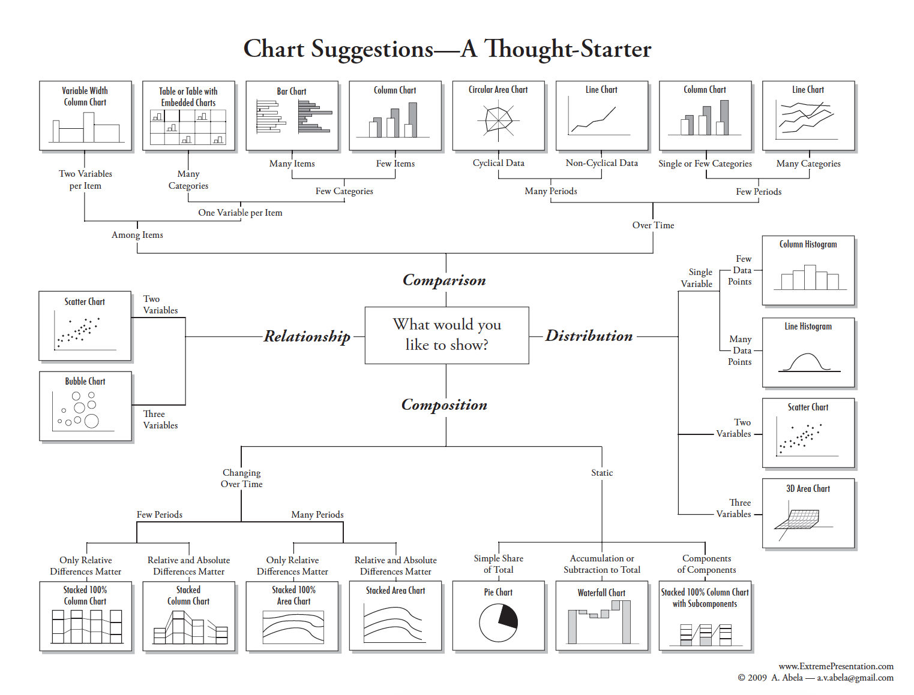

## 0. Data 

In this module, we will use the `iris` data object from the R datasets package, which gives the measurements in centimeters of the variables sepal length and width and petal length and width, respectively, for 50 flowers from 3 species of iris (_I. setosa, I. versicolor, and I. virginica_)


```r
data(iris)
str(iris)
```

```
## 'data.frame':	150 obs. of  5 variables:
##  $ Sepal.Length: num  5.1 4.9 4.7 4.6 5 5.4 4.6 5 4.4 4.9 ...
##  $ Sepal.Width : num  3.5 3 3.2 3.1 3.6 3.9 3.4 3.4 2.9 3.1 ...
##  $ Petal.Length: num  1.4 1.4 1.3 1.5 1.4 1.7 1.4 1.5 1.4 1.5 ...
##  $ Petal.Width : num  0.2 0.2 0.2 0.2 0.2 0.4 0.3 0.2 0.2 0.1 ...
##  $ Species     : Factor w/ 3 levels "setosa","versicolor",..: 1 1 1 1 1 1 1 1 1 1 ...
```

## 1. Base graphics

R has a group of basic graphics functions to create scatterplots, line plots, histograms, boxplots, etc. 

### Histograms

Histograms are visual representations of the distribution of a continuous variable. These plots are an excellent way to explore your data, specially for identifying outliers. The first step to construct a histogram is to "bin" your data into equal size range values (i.e., divide the entire range values into a series of intervals); the second step is to count the number of values that falls into each interval (i.e., the frequency of the values in each bin)


```r
# Using the hist() function
hist(iris$Sepal.Width)

# you can define the number of bins in your histogram with the "breaks=" argument"
sw_his<-hist(iris$Sepal.Width,breaks=10)
```

<!-- -->

```r
sw_his[c("breaks","counts")]
```

```
## $breaks
##  [1] 2.0 2.2 2.4 2.6 2.8 3.0 3.2 3.4 3.6 3.8 4.0 4.2 4.4
## 
## $counts
##  [1]  4  7 13 23 36 24 18 10  9  3  2  1
```

```r
# Without the hist() function

# Divides the range of Sepal.Width into 10 intervals. 
bin_data<-cut(iris$Sepal.Width, breaks = 10)
count_data<-table(bin_data)

barplot(count_data,
        ylab="Frequency",
        xlab="Sepal Width")
```

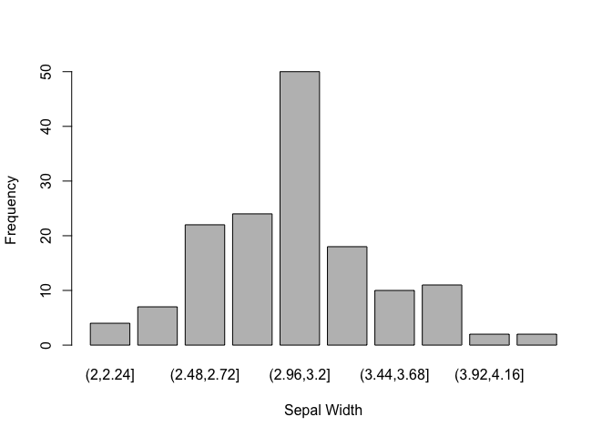<!-- -->

### Boxplots 

Boxplots or box-and-whisker plot are useful for comparing distributions between several groups or sets of data


```r
plot(x=iris$Species,y=iris$Petal.Length,
     ylab="Petal length (cm)",
     xlab="Iris species",
     col="grey")
```

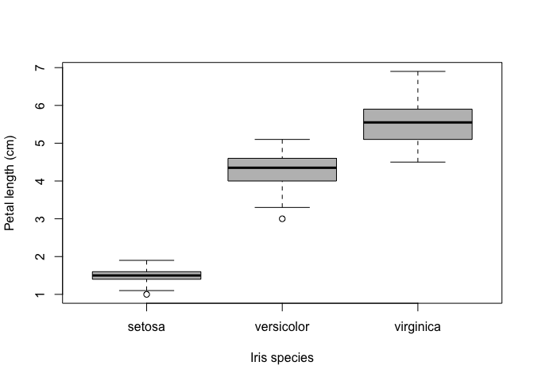<!-- -->


### Scatter plots

Scatter plots show the relationship between sets of continuous variables using cartesians coordinates


```r
plot(x=iris$Sepal.Length,y=iris$Petal.Length)
```

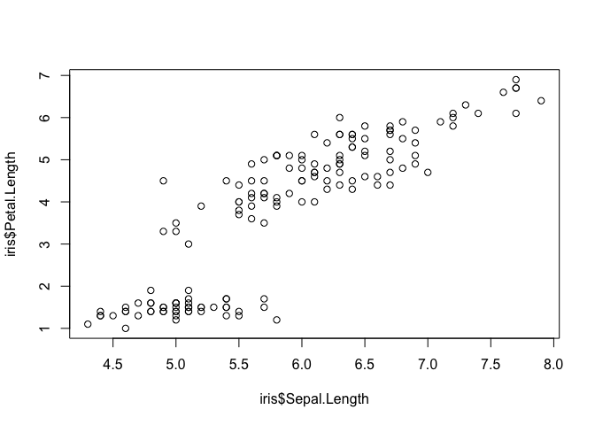<!-- -->

```r
# common formula annotation
plot(Petal.Length~Sepal.Length, data=iris)
```

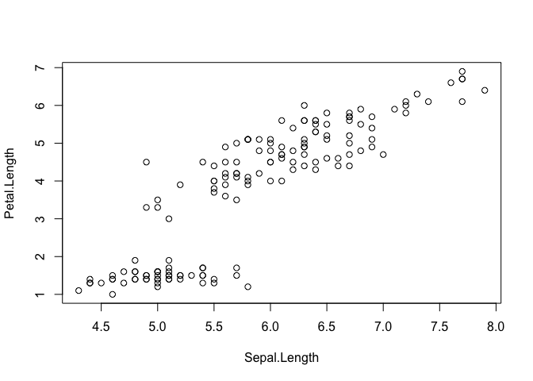<!-- -->

You can customise the plot with the following arguments

  * Axes labels: `xlab=` & `ylab=`
  * Plot title: `main=`
  * Shape and colour of data points:`pch=` & `col=`
  * Use `?plot` or `help(plot)` to see the additional arguments of the function


```r
plot(x=iris$Sepal.Length,y=iris$Petal.Length,
     ylab="Petal length (cm)",
     xlab="Sepal length (cm)",
     main="Petal vs Sepal length", 
     pch=17,
     col="blue")
```

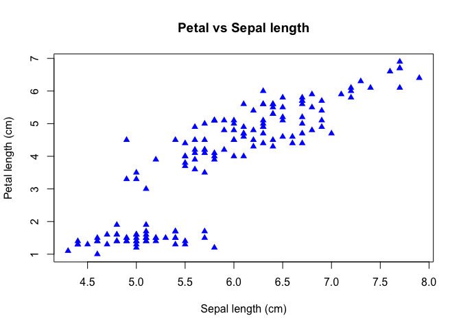<!-- -->

You can also add colours to your points according to different treatments. In this case we can see the relationships between Sepal and Petal length among the species


```r
#select the colors that will be used
library(RColorBrewer)

#all palette available from RColorBrewer
#display.brewer.all() 

#cols contain the names of 3 different colors
cols<-brewer.pal(n=3,name="Set1")

#create a color vector corresponding to levels in the species variable in the iris dataset
cols_sp<-cols[iris$Species]

plot(Petal.Length~Sepal.Length, 
     data=iris, 
     col=cols_sp,
     pch=20)

# Include legend
legend("bottomright",legend=levels(iris$Species),col=cols,pch=20)
```

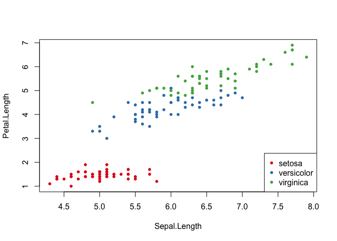<!-- -->


## 2. ggplot2

ggplot2 is a plotting system for R, that provides a powerful model of graphics based on the "grammar of graphics" (i.e., series of fundamental rules to describe the components of a graphic). 

Plots in ggplot2 are built using a multidimensional conditioning and a step-by-step framework.


### Histograms


```r
library(ggplot2)

# ggplot2 is also included in the tidyverse library
# library(tidyverse)

ggplot(data=iris, aes(Sepal.Width)) + 
  geom_histogram(bins=10)
```

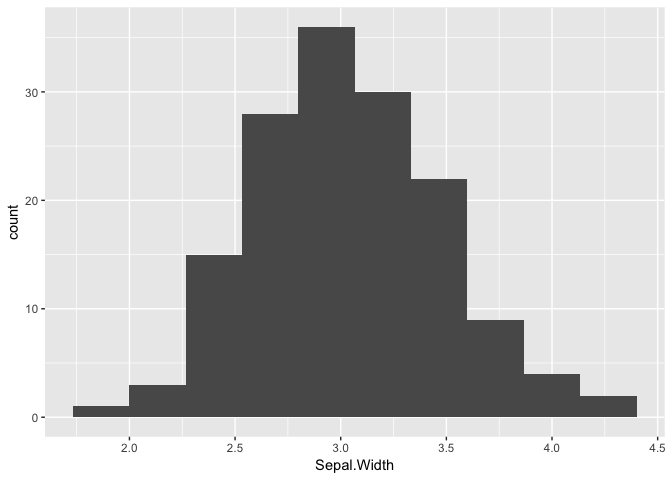<!-- -->

### Boxplots


```r
ggplot(data=iris, aes(x=iris$Species,y=iris$Petal.Length)) +
  geom_boxplot() +
  xlab("Species") +
  ylab("Petal length") +
  ggtitle("Box plot") +
  theme(plot.title = element_text(hjust=0.5))
```

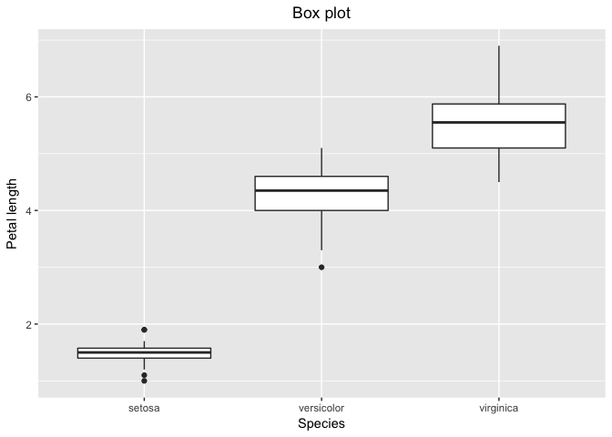<!-- -->

Include date points into the boxplot


```r
ggplot(data=iris, aes(x=iris$Species,y=iris$Petal.Length)) +
  geom_boxplot() +
  geom_jitter(alpha = 0.5, color = "green")+
  xlab("Species") +
  ylab("Petal length") +
  ggtitle("Box plot") +
  theme(plot.title = element_text(hjust=0.5))
```

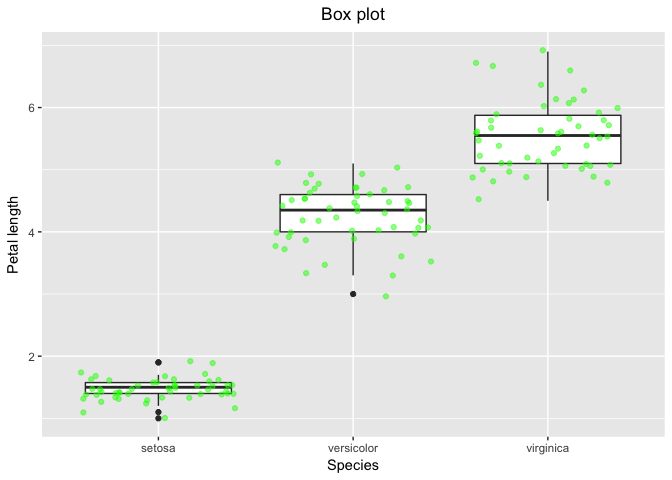<!-- -->


### Scatter plots


```r
ggplot(data = iris, aes(x = Sepal.Length, y = Petal.Length)) +
  geom_point()
```

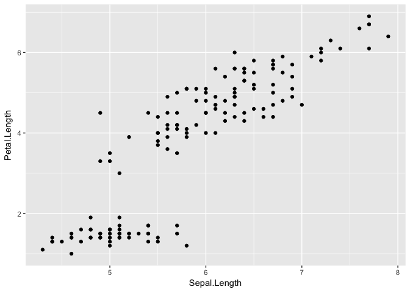<!-- -->

Aesthetic map: color by # of species


```r
ggplot(data = iris, aes(x = Sepal.Length, y = Petal.Length)) +
  geom_point(aes(colour = Species))
```

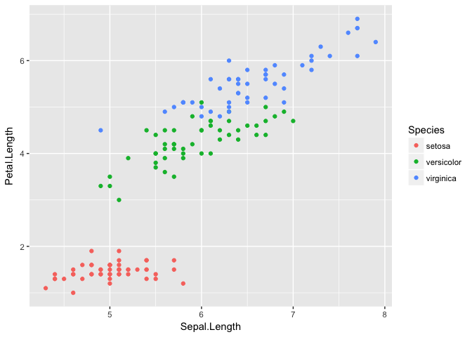<!-- -->

Adjust colour by species and size by Sepal width


```r
ggplot(data = iris, aes(x = Sepal.Length, y = Petal.Length)) +
  geom_point(aes(size = Petal.Width, colour=Species))
```

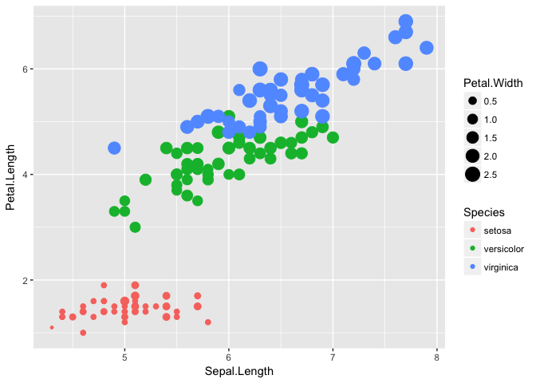<!-- -->

Adjust transparency of points to alpha 0.6 to see overlapping sections


```r
ggplot(data = iris, aes(x = Sepal.Length, y = Petal.Length)) +
  geom_point(aes(size = Petal.Width, colour=Species),alpha = 0.6)
```

<!-- -->

Adjust colour by species and shape by Petal length (categorical variable)


```r
## Create categorical variable for Petal Width (wide vs thin)

iris$Petal_Width_factor<-ifelse(iris$Petal.Width>mean(iris$Petal.Width), "Wide","Thin")

ggplot(data = iris, aes(x = Sepal.Length, y = Petal.Length)) +
  geom_point(aes(shape = Petal_Width_factor, colour=Species),alpha = 0.6, size=4)
```

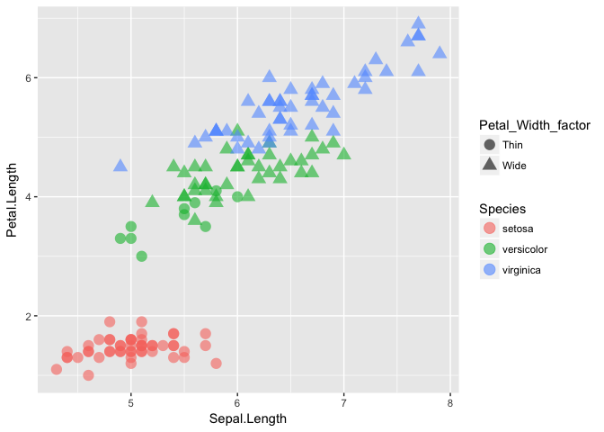<!-- -->

## 3. Challenges

In this module, we are going to try to reproduce some of the plots of the following paper: 

*Böhm M, Kemp R, Williams R, et al. Rapoport's rule and determinants of species range size in snakes. Divers Distrib. 2017; 23:1472–1481*

1. Download the dataset called "ddi12632-sup-0002-AppendixS4.xlsx" provided in the supporting information [here](https://doi.org/10.1111/ddi.12632)

2. Open the file in a spreadsheet program and save it as a csv file into a `data` folder

3. Import the csv file. Do not forget to create a new R project to avoid setting a working directory!

4. Reproduce the Figure 1a and 1b from the Böhm et al., 2017 paper 

5. Reproduce Figure 1d. *Hint: you can use the function `cut()` to divide the mid-latitudinal range into bins or intervals*

6. Reproduce Figures 2a-c using the basic graphic functions in R and ggplot

7. Divide the number of ecoregions into two categorical levels, "Generalist" when the number of ecoregions is greater than the mean of the number of ecoregions across all snakes; and "Specialist" otherwise. 

8. Reproduce Figure 4 adjusting the colour by Generalist vs Specialist
