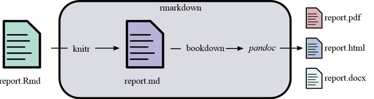
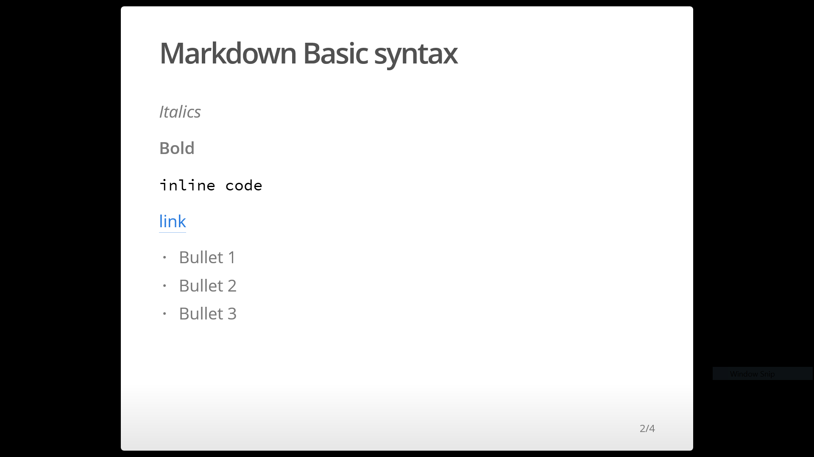
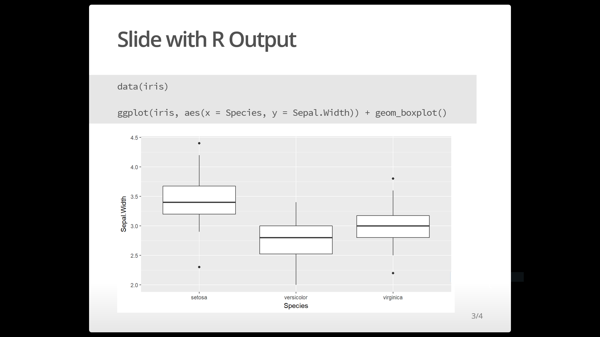
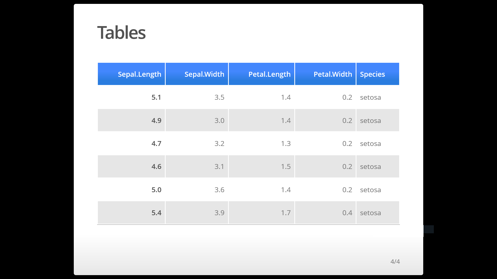

``This document is a work in progress, please give us feedback``

```{r setup, include=FALSE}
knitr::opts_chunk$set(echo = TRUE)
```

# Reproducible documents

## Before we start

1. Install the rmarkdown package ``install.packages("raster")``
2. Open a new R markdown file `*.Rmd`, `File` -> `New file` -> `R markdown`
  * Enter a title and author(s).
  * Choose 'Default Output Format' as HTML (for now)
3. Save the Rmd file
4. knit the document (Windows and Linux, Ctrl+Shift+K; Mac, Command+Shift+K)


  

  
## How does it work?

The `rmarkdown` R package uses and interacts with other packages and programs to create a final document. For example, `knitr` converts the Rmd file into a markdown (.md) file, which is a common format for several websites (including the lectures and guides in this course). `knitr` runs chunks and inline R code and includes the output to a markdown document. `rmarkdown` then calls the `pandoc` program to convert the markdown into different formats. Note that to create a PDF, you need to install [Latex](https://www.latex-project.org/get/). The `bookdown` R package is necessary to number figures, tables and also it can be used to generate books, such as [R for Data Science](http://r4ds.had.co.nz/)





## Main parts of an R Markdown file

### The YAML Header

Included at the top of the R Markdown script, the YAML header enclosed by `----` defines the title, author, date of the document and most importantly the file type you want to output (html, pdf, md, word). 

```
---
title: "Example"
author: "YOUR NAME HERE"
date: "01/30/2017"
output: html_document
---
```
You can also alter the appearance and style of your document with different arguments. For example, `toc: true` will include a table of content. Click [Here](https://rmarkdown.rstudio.com/html_document_format.html) to see other arguments. 

```
---
title: "Example"
author: "YOUR NAME HERE"
date: "01/30/2017"
output: 
  html_document:
  toc: true
---
```

### Markdown Basic syntax

[R Markdown Cheat sheet](https://www.rstudio.com/wp-content/uploads/2015/02/rmarkdown-cheatsheet.pdf)

```
# Header 1
## Header 2
### Header 3

*Italics*
**Bold**
`inline code`
[link](https://rmarkdown.rstudio.com/)

* Bullet Lists
  + Subitems


```
* Markdown Quick Reference `Help`-> `Markdown Quick Reference`
* R Markdown reference guide `Help`->`Cheatsheets`-> `R Markdown Cheat Sheet` or `R Markdown Reference Guide`

### Code Chunks

```{r setup2, include = FALSE}
library(tidyverse)
chunk <- "```"
inline <- function(x = "") paste0("`` `r ", x, "` ``")

```

To run R code inside an R Markdown

* The keyboard shortcut Cmd/Ctrl + Alt + I
* Or "Insert" button icon in the toolbar

<pre><code>```{r}
msg<-"Hello world"
msg
```</code></pre>


```{r}
msg<-"Hello world"
msg
```

### Chunks options

To modify how they run and how they appear in the document

**Show only the output**

<pre><code>```{r echo=FALSE}
msg<-"Hello world"
msg
```</code></pre>

```{r echo=FALSE}
msg<-"Hello world"
msg
```

**Run code but does not display code or ouput**

<pre><code>```{r include=FALSE}
msg<-"Hello world"
msg
```</code></pre>

```{r include=FALSE}
msg<-"Hello world"
msg
```

**Print code but does not run it**

<pre><code>```{r eval=FALSE}
msg<-"Hello world"
msg
```</code></pre>

```{r eval=FALSE}
msg<-"Hello world"
msg
```

**Naming chunks**

<pre><code>```{r hello_world, eval=FALSE}
msg<-"Hello world"
msg
```</code></pre>

```{r hello, eval=FALSE}
msg<-"Hello world"
msg
```

### Inline Code

To incorporate R outputs into the text

The class of the object msg is `r inline("class(msg)")` and it has `r inline("length(msg)")` elements

The class of the object msg is `r class(msg)` and it has `r length(msg)` elements


### Inserting plots

By default

<pre><code>```{r plot1}

data(iris)

ggplot(iris, aes(x = Species, y = Sepal.Width)) + geom_boxplot()

```</code></pre>

```{r plot1}

data(iris)

ggplot(iris, aes(x = Species, y = Sepal.Width)) + geom_boxplot()

```

Setting figure dimensions


<pre><code>```{r plot2, fig.width=2.5, fig.height=7.5}

data(iris)

ggplot(iris, aes(x = Species, y = Sepal.Width)) + geom_boxplot()

```</code></pre>

```{r plot2, fig.width=4, fig.height=6}

data(iris)

ggplot(iris, aes(x = Species, y = Sepal.Width)) + geom_boxplot()

```

You can include the argument `dev="svg"` to render your plot as a vector format `.svg` instead of the default format `.png`


### Tables

By default

<pre><code>```{r }

head(iris)

```</code></pre>

```{r }
head(iris)

```

A bit messy right?  For a more pleasing table, we can use the function `kable` from the R package `knitr`


<pre><code>```{r}

head(iris)

```</code></pre>


```{r }
require(knitr)
kable(head(iris))

```

Or you can direclty create table in markdown syntax

```
| Species| Var1  | Var2   |
|:------ |:-----:|-------:|
| A      | 20    | 0.65   |
| B      | 20    | 0.95   |
| C      | 20    | 0.15   |
```

| Species| Var1  | Var2   |
|:------ |:-----:|-------:|
| A      | 20    | 0.65   |
| B      | 20    | 0.95   |
| C      | 20    | 0.15   |


# Reproducible slide presentations

1. Open a new R markdown file `*.Rmd`, `File` -> `New file` -> `R markdown` -> `Presentation`
  * Enter a title and author(s).
  * Choose 'Default Output Format' as HTML (ioslides) (for now)
2. Save the Rmd file

3. knit the document (Windows and Linux, Ctrl+Shift+K; Mac, Command+Shift+K)

4. Open the html in a browser


## Display Modes

When you open the html in a browser, use the following character keyboard shortcuts to enable alternate display modes:

* `f` enable fullscreen mode

* `w` toggle widescreen mode

* `o` enable overview mode

* `h` enable code highlight mode

Press `Exit` to exit all the display modes


## The YAML Header

```
---
title: "Example"
author: "YOUR NAME HERE"
date: "01/30/2017"
output: ioslides_presentation
---
```

By default the argument `echo=FALSE`. Check the setup at the beginning of the document. 


<pre><code>```{r}

knitr::opts_chunk$set(echo = FALSE)

library(tidyverse)
library(knitr)

```</code></pre>


## Markdown Basic syntax


```

## Markdown Basic syntax


*Italics*

**Bold**

`inline code`

[link](https://rmarkdown.rstudio.com/)

- Bullet 1
- Bullet 2
- Bullet 3

```




## Plots


```
## Slide with R Output
```

<pre><code>```{r echo=TRUE, fig.height=4}

data(iris)

ggplot(iris, aes(x = Species, y = Sepal.Width)) + geom_boxplot()

```</code></pre>





## Tables

```
## Tables

```

<pre><code>```{r table}

kable(head(iris))

```</code></pre>





**You can see additional ioslides arguments and options in the following link https://rmarkdown.rstudio.com/ioslides_presentation_format.html**


