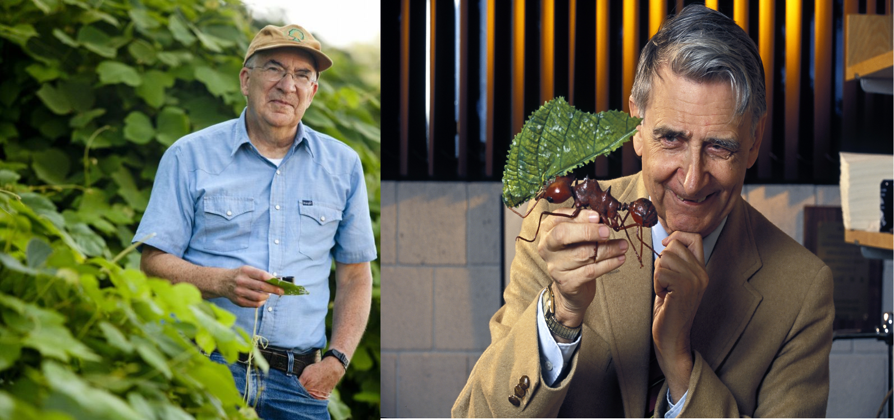

```{r setup, include=FALSE}
options(htmltools.dir.version = FALSE)
```

class: inverse, center, middle

background-image: url(https://upload.wikimedia.org/wikipedia/commons/8/80/NASA_Hawaiian_Islands_main_islands.png)

# Island Biogeography

---
class: center, middle


---
### Number of species as function of the rate of migration/colonization and extinction

---
class: center, middle

---
## Empirical studies

- Jared Diamond, 1969. Number of birds that breed in the California channel Islands


---
class: center, middle


---

## Archipelago


---
## Distance to mainland


---
class: center, middle


---
class: center

## Empirical studies

- Simberloff and Wilson, 1969. Arthropods in the Florida Keys. 



---
class: center


---


---
## Area


---


---
class: center, middle


Source: http://www.biodiverseperspectives.com/

---
# Why is this important? 


---

---

---
class: center

*Paper discussion*


---