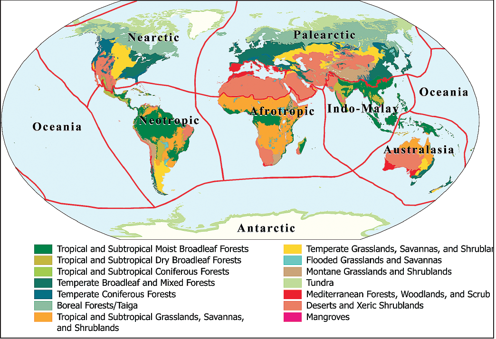

``This document is a work in progress, please give us feedback``

```{r setup, include=FALSE}
knitr::opts_chunk$set(echo = TRUE)
library(knitr)
library(kableExtra)
```

```{r message=FALSE, warning=FALSE}
library(tidyverse)
library(rredlist)
library(foreach)
library(dismo)
library(speciesgeocodeR)
```


# Data
In this tutorial we are going to work with the order of mammals `Hyracoidea` commonly known as Hyraxes


```{r message=FALSE, warning=FALSE}
Amniotes<-read.csv("./data/Amniote_Database_Aug_2015.csv")
Amniotes[Amniotes==-999]<-NA

Hyracoidea<-
  Amniotes %>% 
  filter(class == "Mammalia" & order =="Hyracoidea")
```

# Extracting the IUCN status for each species

The R package `taxize` allows us to extract the IUCN status automatically. However, the functions of this package require an API key. Get the key at http://apiv3.iucnredlist.org/api/v3/token, and pass it to the key parameter, or store in your .Renviron file like `IUCN_REDLIST_KEY=yourkey`

```{r include=FALSE}
iucn_key<-"0b62357effbfe43b2324a5a1ac9df09d7b641e6a27ccaeb4fefb87747a0eea81"
```

```{r eval=FALSE, include=TRUE}
Sys.setenv(IUCN_REDLIST_KEY=iucn_key)
```

The function `iucn_summary` in the taxize package requires as an input the binomial name of the species

```{r eval=FALSE, message=FALSE, warning=FALSE, include=TRUE}
Hyracoidea$Binomial<-paste(Hyracoidea$genus,Hyracoidea$species)

ia <- iucn_summary(Hyracoidea$Binomial)
species_iucn<-iucn_status(ia)

## Include the info into the data frame
Hyracoidea$iucn<-species_iucn
```

```{r include=FALSE}
Hyracoidea<-read.csv("./data/tmp.csv", row.names = 1)
```


```{r}
Hyracoidea[,c("Binomial","iucn")]
```

# Using for loops to extract the species GBIF records

## Examples with one species

We need to define both column `genus` and `species` as characters before we use them on the `gbif` function. They were pre-defined as factors. 

Since we don't need all the information extracted from gbif, here we will select only the `species` ,`lat` ,`lon` ,`fullCountry` variables

```{r eval=FALSE, include=TRUE}
Hyracoidea$genus<-as.character(Hyracoidea$genus)
Hyracoidea$species<-as.character(Hyracoidea$species)

Hyracoidea_sp1<-gbif(Hyracoidea$genus[1],Hyracoidea$species[1])[c("species","lat","lon","fullCountry")]
```

## Traditional For loops

```{r eval=FALSE, include=TRUE}
gbif_records<-NULL ## 1. output

for (i in 1:length(Hyracoidea$Binomial)){   ## 2. Sequence
  
  ## 3. Body
  Hyracoidea_sp<-gbif(Hyracoidea$genus[i],Hyracoidea$species[i])[c("species","lat","lon","fullCountry")]
  gbif_records<-rbind(gbif_records,Hyracoidea_sp)
  
}
```

## For loops using the function `foreach`

```{r eval=FALSE, include=TRUE}
gbif_records <-
  foreach(i=1:length(Hyracoidea$Binomial),.combine = rbind)%do%{
    
    gbif(Hyracoidea$genus[i],Hyracoidea$species[i])[c("species","lat","lon","fullCountry")]
    
  }
```

```{r include=FALSE}
gbif_records<-read.csv("./data/gbif.csv", row.names = 1)
```


Before merging our GBIF record into the life-history trait data frame, remember to clean your geographic data

```{r}
## Cleaning records
gbif_records<-
  gbif_records %>% 
  dplyr::filter(!is.na(lon)&!is.na(lat))

## Get rid of duplicate occurrences
dups=duplicated(gbif_records[, c("lon", "lat")])
gbif_records <-gbif_records[!dups, ]


## Merging data frames
Hyracoidea_df<-merge(Hyracoidea,gbif_records, by.x="Binomial", by.y="species")
```

# WWF terrestrial biomes and ecoregions data

The [terrestrial ecoregions of the world (TEOW)](https://www.worldwildlife.org/publications/terrestrial-ecoregions-of-the-world) from the World Wild Fund (WWF) represent a biogeographic framework to map earth's biodiversity. This framework is mainly based on the publication by Olson et al., 2001. 

*Olson, D. M., Dinerstein, E., Wikramanayake, E. D., Burgess, N. D., Powell, G. V. N., Underwood, E. C., D'Amico, J. A., Itoua, I., Strand, H. E., Morrison, J. C., Loucks, C. J., Allnutt, T. F., Ricketts, T. H., Kura, Y., Lamoreux, J. F., Wettengel, W. W., Hedao, P., Kassem, K. R. 2001. Terrestrial ecoregions of the world: a new map of life on Earth. Bioscience 51(11):933-938*

This biogeographic regionalisation consists of 867 terrestrial ecoregions, classified into 14 biomes and eight realms.



## Download the WWF ecoregions data

To access these maps, you can either download the data from the WWF [website](https://www.worldwildlife.org/publications/terrestrial-ecoregions-of-the-world) or through the function `WwfLoad()` from the R package `speciesgeocodeR`

To use the `WwfLoad()` function, you only need to specify the directory path where you want the data to be store.

```{r eval=FALSE, include=TRUE}
wwf_eco <-WwfLoad(x = "./data/spatial/")
```

The WWF ecoregions are stored in a vector format, which represent discrete geometric locations (x,y values) known as vertices that define the shape of the spatial objects (e.g., points, lines and polygons). Here, the ecoregions and biomes are represented by spatial polygons which are usually stored in `shapefiles`. There are several functions in R that allows you to read shapefiles. One is using the function `shapefile` from the `raster` package or the `readOGR` function from the `rgdal` package

```{r message=FALSE, warning=FALSE}
require(raster)
wwf_eco<-shapefile("./data/spatial/WWF_ecoregions/official/wwf_terr_ecos.shp")

require(rgdal)
## readOGR("path","layerName") 
wwf_eco <- readOGR("./data/spatial/WWF_ecoregions/official/",
                            "wwf_terr_ecos")
```


**ATTENTION: Please include the path of the directory where you store your spatial data into the .gitignore file to avoid problems with Github when you push your commits!**

Like rasters, shapefiles are geospatial objects, and therefore they also include spatial data attributes such as Coordinate Reference System (CRS) and extent

```{r}
class(wwf_eco)

crs(wwf_eco)

extent(wwf_eco)
```

## Extract information from the Spatial polygons

In this exercise, we want to extract the information about the realms and biomes that fall on each of our species occurrences. To do that, we first need to convert our occurrence data into a spatial data frame, and second, we need to make sure our spatial data frame has the same projection and coordinate system as the spatial polygons. 

```{r}
# 1. Convert to spatial data frame
Hyracoidea_geo<-Hyracoidea_df
coordinates(Hyracoidea_geo)<-~lon + lat

# 2. Make sure both files have the same projection
proj4string(Hyracoidea_geo)<-proj4string(wwf_eco)
```

Now we can extract the information using the function `over` from the `sp` r package. This function overlay the ecoregions and biomes polygons on our spatial data frame and then retrieves the attributes for each occurrence. 

```{r}
biome_data<-over(Hyracoidea_geo,wwf_eco)[c("REALM","BIOME","G200_REGIO")]

# Include these three columns into our original data frame
Hyracoidea_df<-cbind(Hyracoidea_df,biome_data)
Hyracoidea_df<-droplevels(Hyracoidea_df)

kable(head(Hyracoidea_df[,c("lat","lon","fullCountry","REALM","BIOME","G200_REGIO")]))
```

As you can see, the BIOMES levels are represented by numbers. To look at the numbers equivalence, we need to check the [metadata](https://www.lib.ncsu.edu/gis/esridm/2004/help/world/wwf_terr.sdc.htm#1) of the WWF biomes. In our example, **7** represents _Tropical & Subtropical Grasslands, Savannas & Shrublands._ and **1** _Tropical & Subtropical Moist Broadleaf Forests_. In the metadata, you can also check the meaning of each REALM abbreviation (e.g., AT is equivalent to Afrotropics). 


